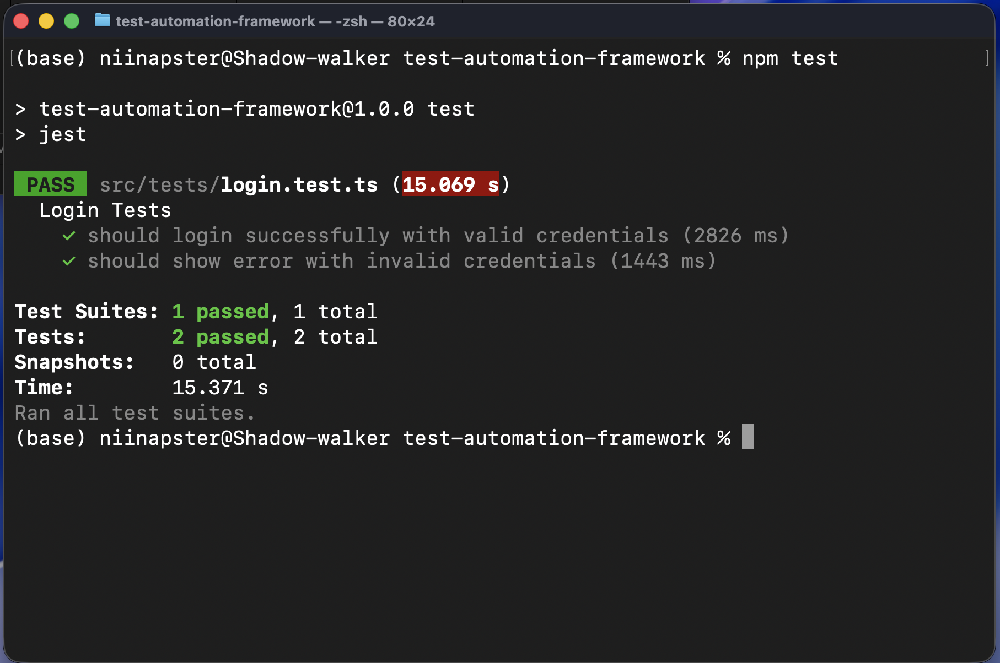

# Tool-Agnostic Test Automation Framework

<p align="center">
  
  
  
  
  
</p>

---

### Universal Test Framework: Write Once, Run Anywhere

This project is a **modern, extensible Test Automation Framework** designed with a **tool-agnostic architecture**.  
It allows you to **switch between Playwright, Selenium, Cypress**, or any other automation tool, **without changing your tests**.

---

## Core Concept

At its heart, this framework follows a **Page Object Model (POM)** pattern, wrapped in a layer of **interfaces and adapters**.  
This abstraction ensures your test logic remains the same regardless of the underlying tool or language.

Test → Page Objects → Interfaces → Adapters → Tool (Playwright / Selenium / etc.)


---

## Architecture Overview
```bash
test-automation-framework/
├── src/
│ ├── core/
│ │ ├── interfaces/ # IPage, IElement, IBrowser - abstraction layer
│ │ ├── adapters/ # Tool-specific adapters (Playwright, Selenium, etc.)
│ ├── pages/ # Page Object classes (LoginPage, BasePage, etc.)
│ ├── tests/ # Test specs using POM
│ ├── utils/ # Reusable helpers
│ └── config/ # Environment/test data configuration
├── screenshots/ # Test screenshots
├── reports/ # Test execution reports
├── jest.config.js # Jest configuration
├── tsconfig.json # TypeScript configuration
└── package.json
```


---

## Key Features

- ✅ **Tool-Agnostic Design**: Swap Playwright, Selenium, or Cypress easily  
- 🧩 **Page Object Model (POM)**: Maintainable and modular structure  
- ⚙️ **TypeScript Support**: Full type safety and modern syntax  
- 🧪 **Jest Test Runner**: Lightweight and powerful testing framework  
- 📸 **Screenshot & Reporting Ready**  
- 🧹 **Prettier + ESLint**: Clean, consistent code style  

---

## 🧰 Tech Stack

| Category | Tool / Library |
|-----------|----------------|
| Language | **TypeScript** |
| Test Runner | **Jest** |
| Automation | **Playwright**, *(extensible to Selenium, Cypress)* |
| Architecture | **Page Object Model (POM)** + **Adapter Pattern** |
| Linting & Formatting | **ESLint**, **Prettier** |
| CI/CD | **GitHub Actions / Jenkins (optional)** |

---

## 🚀 Getting Started

```bash
# 1️ Clone the repository
git clone https://github.com/natedotdev/test-automation-framework.git

# 2️ Navigate into the project
cd test-automation-framework

# 3️ Install dependencies
npm install

# 4️ Install Playwright browsers
npx playwright install

# 5️ Run the sample tests
npm test

```


## Extending the Framework
```bash
New adapters to support different tools:
src/core/adapters/
├── PlaywrightAdapter.ts
├── SeleniumAdapter.ts
└── CypressAdapter.ts
```

<i>Each adapter implements the same interfaces, so tests never change, only the adapter layer does.</i>

## Screenshots & Reports
 initial test run (Jest + Playwright)
 
